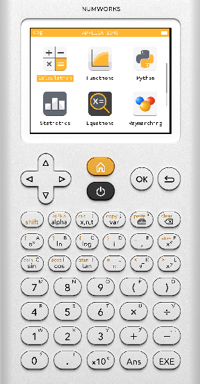
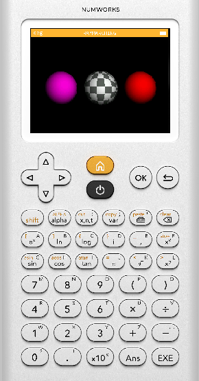
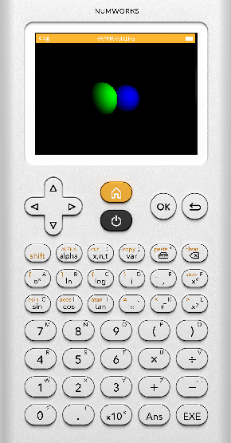

# NumWorks 3D Graphics
This is an [Epsilon](https://github.com/numworks/epsilon) mod that showcases 3D Rendering on the NumWorks calculator.
This project is an unofficial mod and is **not** maintained by NumWorks.

## Installation
To install this mod on your calculator, follow the instructions described on NumWorks' [Installing the SDK](https://www.numworks.com/resources/engineering/software/build/) page but clone this repository instead of [`numworks/epsilon`](https://github.com/numworks/epsilon).

## Currently available app(s)
### Ray marching
Currently, Ray marching is the only available rendering engine. To use it, simply enter the `Raymarching` app from the Home screen. You will see a fast preview of the scene. Use the arrows to navigate through the scene and the `A`and `C` keys to rotate the camera.
To start the high-res render of the scene, press `OK`or `EXE`. **Warning:** Rendering takes a while, and can not be interrupted! You will have to wait a bit.
Use `1` and `2` to switch between the two currently implemented scenes. 

**Screenshots**  
  
  
  

## License

NumWorks Epsilon is released under a [CC BY-NC-SA License](https://creativecommons.org/licenses/by-nc-sa/4.0/legalcode). NumWorks is a registered trademark. All original Epsilon code belongs to NumWorks and therefore follows their license described [here](https://github.com/numworks/epsilon/blob/master/LICENSE). 
The term "original code" designates all code that has been written by NumWorks or any other contributor of the *Epsilon* project.

